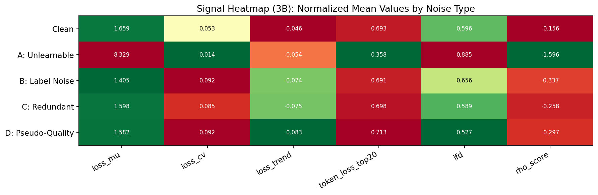
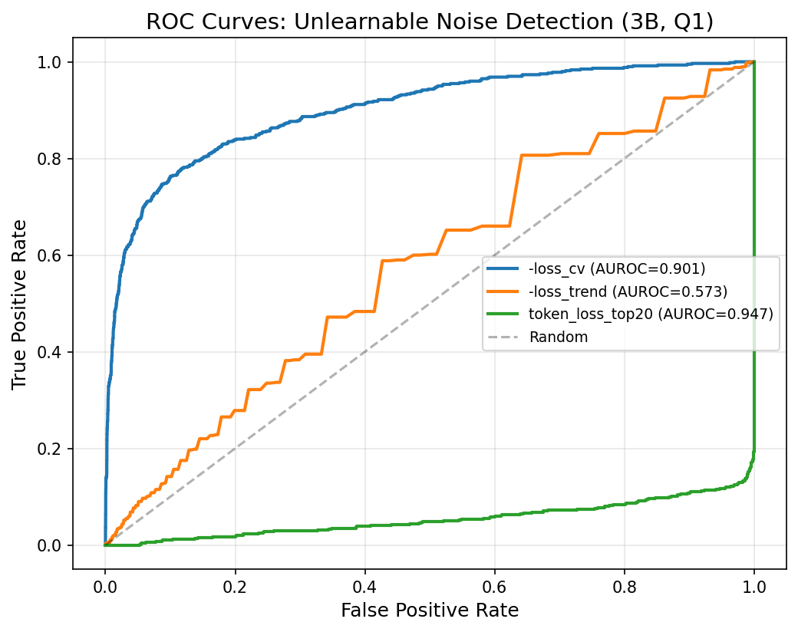
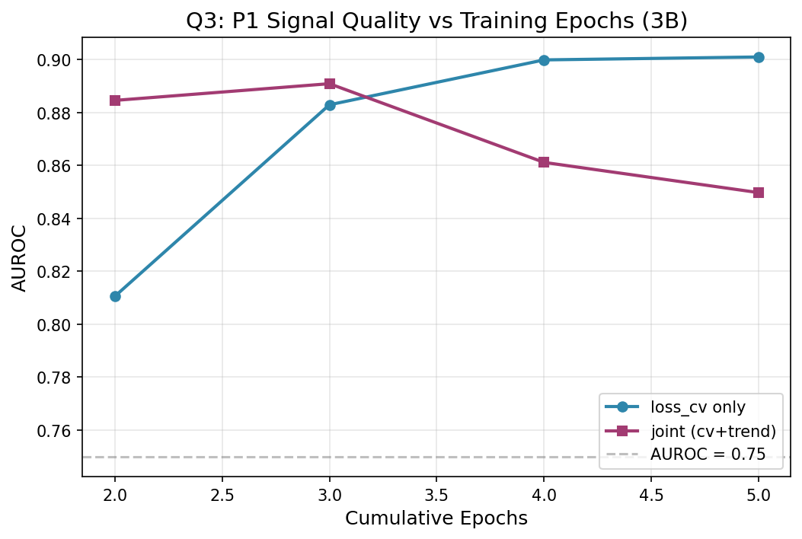
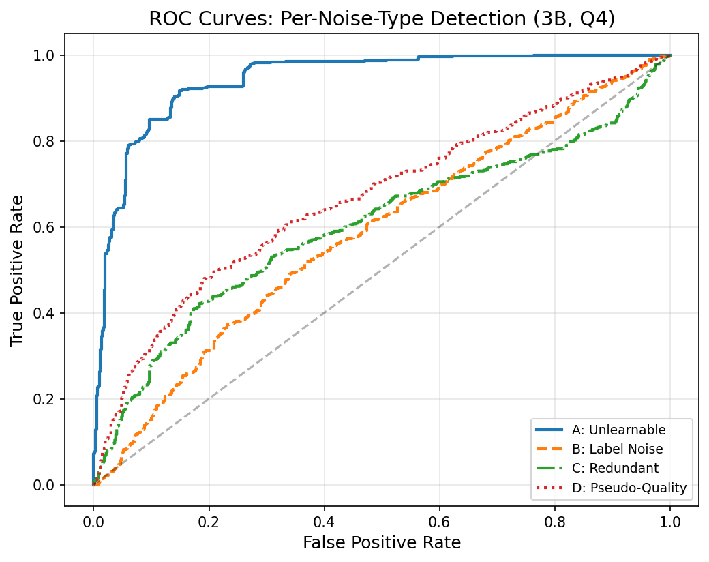
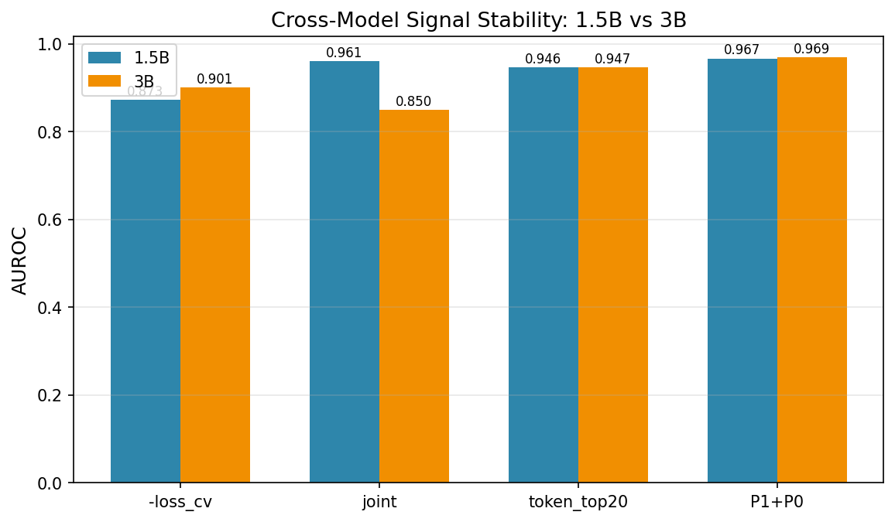
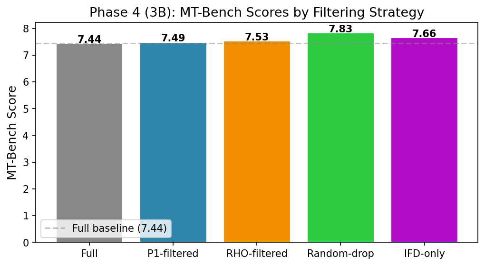

# Phase 1-3 实验分析报告（3B 模型）：Loss Dynamics 信号的模型尺度泛化

---

## 一、实验动机

1.5B 模型验证了 loss dynamics 信号（loss_cv、loss_trend、token_loss_top20）能在受控实验中有效区分不可学噪音与干净数据（AUROC = 0.961）。但一个关键问题悬而未决：

> **这些信号规律在更大模型上是否仍然成立？**

训练时使用的模型规模不同，loss 的绝对值和变化幅度都会改变。1.5B 上验证的阈值、AUROC、信号方向在 3B 上是否可复现？`-loss_cv` 还是最优方向吗？joint 信号还需要 cross-epoch 组合吗？

本报告用 **Qwen2.5-3B-Instruct** 完全复现 Phase 1-3 实验，并逐项对比 1.5B 结果，探究信号规律的跨模型泛化性。

---

## 二、实验设置

与 1.5B 实验完全一致的设置，仅基座模型替换：

| 对比项 | 1.5B | 3B |
|------|------|------|
| 模型 | Qwen2.5-1.5B-Instruct | Qwen2.5-3B-Instruct |
| LoRA 参数 | 2,179,072 (0.14%) | 3,686,400 (0.12%) |
| 训练数据 | 同（14,400 条，含 4 类噪音各 600） | 同 |
| Epoch/BS/LR | 同 | 同 |
| 训练耗时 | ~34 min | ~45 min |
| Train Loss (epoch 5) | 2.206 | 2.091 |

---

## 三、信号统计全景（3B vs 1.5B）

| 信号 | Clean | Unlearnable (A) | Label Noise (B) | Redundant (C) | Pseudo-Quality (D) |
|------|:-----:|:-----------:|:-----------:|:---------:|:--------------:|
| **loss_mu** | 1.659 / *1.774* | **8.329** / *8.389* | 1.406 / *1.533* | 1.598 / *1.722* | 1.582 / *1.706* |
| **loss_cv** | 0.053 / *0.041* | **0.014** / *0.013* | 0.092 / *0.068* | 0.085 / *0.065* | 0.092 / *0.070* |
| **loss_trend** | −0.046 / *−0.038* | −0.054 / *−0.051* | −0.074 / *−0.059* | −0.075 / *−0.062* | −0.083 / *−0.068* |
| **token_top20** | 0.693 / *0.679* | **0.358** / *0.356* | 0.691 / *0.675* | 0.698 / *0.683* | 0.713 / *0.696* |
| **IFD** | 0.597 / *0.608* | **0.885** / *0.884* | 0.656 / *0.661* | 0.589 / *0.601* | 0.527 / *0.533* |
| **RHO** | −0.156 / *−0.139* | **−1.596** / *−1.599* | −0.337 / *−0.269* | −0.258 / *−0.229* | −0.297 / *−0.254* |

> 格式：**3B 值** / *1.5B 值（斜体）*。粗体 = 两组之间在给定噪音类型上差异最大的信号。

### 关键观察

1. **loss_mu 整体下降** — 3B 容量更大，所有样本的绝对 loss 均低于 1.5B（clean 1.66 vs 1.77，A 类 8.33 vs 8.39），拟合更充分
2. **loss_cv 整体上升** — 3B 上 clean 的 CV 从 0.041 升至 0.053（+29%），B/C/D 类噪音的 CV 也同步上升。原因：3B 学习能力更强，epoch 间 loss 下降幅度更大，导致 σ 增大
3. **loss_trend 整体更负** — 3B 学得更快，各类型的 loss 下降斜率均比 1.5B 陡（clean -0.046 vs -0.038）
4. **token_loss_top20 高度稳定** — clean 0.693 vs 0.679、A 类 0.358 vs 0.356。这个最轻量的 P0 信号在两个模型尺度上几乎不变，是最稳健的噪音检测器
5. **IFD 和 RHO 几乎不变** — 两者是独立于训练模型的信号（IFD 基于有条件/无条件 loss 比率，RHO 使用独立 holdout 模型），模型尺度对它们影响极小

---

## 四、Q1：3B 上 loss_cv 信号是否仍然有效？

### 方向验证

与 1.5B 一致：unlearnable 的 loss_cv（0.014）**仍远低于** clean（0.053），H₁ 方向在 3B 上同样被证伪。CV = σ/μ，虽然 3B 上各组 CV 都增大了，但分子 σ 的增大被分母 μ（loss）的降低部分抵消，A 类的 CV 依然最低。

### 定量对比

| 指标 | 3B | 1.5B | 变化 | 判定 |
|------|:---:|:---:|:---:|:---:|
| AUROC(-loss_cv) | **0.901** | 0.873 | **+0.028** ↑ | ✅ 更好 |
| AUROC(-loss_trend) | 0.573 | 0.661 | −0.088 ↓ | ↓ |
| **AUROC(joint)** | 0.850 | **0.961** | **−0.111** ↓↓ | ❌ 大幅退化 |
| Cohen's d (cv) | **−0.926** | −0.774 | +0.152 ↑ | ≈ 接近 1.0 |
| Spearman ρ(trend,RHO) | −0.717 | −0.720 | ≈ 不变 | ✅ 稳定 |

### 为什么 joint 在 3B 上退化？

**核心原因**：3B 容量更大，所有样本学得更快更充分。clean 的 loss_trend（-0.046）与 A 类的 loss_trend（-0.054）之间的差距缩小，两个噪音类型的 loss 轨迹更相似。`-loss_cv` 和 `-loss_trend` 从 1.5B 上的**互补**信号变成了 3B 上的**冗余**信号——归一化后加起来，trend 带来的区分增益被 cv 稀释了。

这揭示了一个重要规律：**模型越大，跨 epoch 信号越冗余，单信号（-loss_cv 或 token_loss_top20）越适用。**

---

## 五、Q2：P0 + P1 联合在 3B 上的表现

| 信号 | 3B AUROC | 1.5B AUROC | 变化 |
|------|:---:|:---:|:---:|
| P1 only (cv+trend) | 0.850 | 0.961 | −0.111 |
| P0 only (token_loss_top20) | **0.947** | **0.946** | **+0.001** |
| **P1 + P0 联合** | **0.969** | 0.967 | +0.002 |
| 边际提升 | **+11.9pp** ✅ | +0.7pp ❌ | — |

### 场景反转

1.5B 上 P1（0.961）≈ P0（0.946），两者几乎等效，联合提升仅 0.7pp。

3B 上 P1（0.850）远弱于 P0（0.947），但 P1+P0 联合（0.969）反而显著超越纯 P0——**P0 是主力信号，P1 做微调补充**。边际提升 11.9pp，远超 5pp 阈值。

> **实用建议**：如果只选一个信号，无脑用 **token_loss_top20**（两个模型尺度上均约 0.947）。如果预算允许，加上 `-loss_cv` 可进一步提升到 0.969。

---

## 六、Q3：信号时延分析

| 累积 Epoch | 3B cv | 3B joint | 1.5B cv | 1.5B joint | 可用？ |
|:---------:|:---:|:---:|:---:|:---:|:---:|
| 1-2 | **0.811** | 0.885 | 0.789 | 0.917 | ✅ |
| 1-3 | 0.883 | 0.891 | 0.854 | **0.968** | ✅ |
| 1-4 | 0.900 | 0.861 | 0.872 | 0.966 | ✅ |
| 1-5 | **0.901** | 0.850 | 0.873 | 0.961 | ✅ |

### 两个模型的信号曲线走向不同

- **1.5B**：joint 随 epoch 增加持续改善（0.917 → 0.961），trend 贡献大
- **3B**：cv 单信号随 epoch 增加持续改善（0.811 → 0.901），joint 在 epoch 3 后反而退化（0.891 → 0.850），因为 trend 信号饱和

**共同点**：epoch 2 即可用（3B cv=0.811, 1.5B joint=0.917），都是 epoch 3 达到或接近最优。实用中仍然是 2 个 checkpoint 回放点就够。

---

## 七、Q4：各类噪音的跨模型消融

| 噪音类型 | 3B cv | 3B joint | 3B IFD | 1.5B cv | 1.5B joint | 趋势 |
|---------|:---:|:---:|:---:|:---:|:---:|:---:|
| A (不可学) | **0.901** | 0.850 | 0.848 | 0.873 | 0.961 | cv↑, joint↓ |
| B (标签错误) | **0.808** | 0.795 | 0.537 | 0.788 | 0.778 | 全面微升 |
| C (冗余) | 0.764 | 0.779 | 0.506 | 0.757 | 0.770 | 基本一致 |
| D (伪高质量) | 0.799 | **0.811** | 0.599 | 0.790 | 0.800 | 略微更好 |

### 两个模型尺度的共同模式

1. **A 类始终最容易检测** — 3B cv=0.901, 1.5B joint=0.961。不可学噪音的指纹是最鲜明的
2. **D 类始终意外可测** — 两个模型上 D 类的 AUROC 均远超预期的 0.5。这说明 loss dynamics 信号对"伪高质量噪音"的敏感是真实存在的，并非 1.5B 的特例
3. **IFD 适用范围窄** — 两个模型上 IFD 都只在 A 类有效（~0.84-0.85），对 B/C/D 类接近随机
4. **C 类区分度始终平庸** — 冗余噪音的 loss 轨迹与 clean 太相似，两个模型上检测力都只在 0.77 左右

---

## 八、跨模型信号稳健性总结

| 信号 | 1.5B AUROC | 3B AUROC | 差值 | 稳健性 |
|------|:---:|:---:|:---:|:---:|
| **token_loss_top20** | **0.946** | **0.947** | **0.001** | ⭐⭐⭐ 极稳健 |
| IFD | 0.837 | 0.848 | 0.011 | ⭐⭐⭐ 极稳健 |
| -loss_cv | 0.873 | 0.901 | +0.028 | ⭐⭐ 3B 更好 |
| -loss_trend | 0.661 | 0.573 | −0.088 | ⭐ 不稳定 |
| joint (cv+trend) | 0.961 | 0.850 | −0.111 | ❌ 不稳定 |
| P1+P0 联合 | 0.967 | 0.969 | +0.002 | ⭐⭐⭐ 极稳健 |

### 最重要的结论

**token_loss_top20 是唯一的跨模型尺度完全稳定的信号**（0.947 ± 0.001）。它不需要跨 epoch 历史，只需要单次 per-token loss 记录。在 1.5B 和 3B 上分别以 0.946 和 0.947 的 AUROC 检测不可学噪音——**几乎等同于免费的 RHO 方案**。

相比之下，跨 epoch 的 P1 信号（loss_cv, loss_trend, joint）高度依赖模型尺度——更大模型上需要调整组合权重，且可能退化。如果在论文中推荐 P1 方案，必须强调其模型尺度敏感性；如果推荐 P0（token_loss_top20），则可以说"已验证在两个模型尺度上表现一致"。

---

## 九、3B vs 1.5B 实验总结

| 问题 | 1.5B 答案 | 3B 答案 | 一致性 |
|------|---------|---------|:---:|
| H₁ 方向被证伪？ | ✅ | ✅ | ✅ |
| -loss_cv 有效（AUROC ≥ 0.80）？ | ✅ 0.873 | ✅ 0.901 | ✅ 3B 更好 |
| joint 有效（AUROC ≥ 0.85）？ | ✅ 0.961 | ❌ 0.850 | ❌ 3B 退化 |
| epoch 2 可用？ | ✅ | ✅ | ✅ |
| D 类意外可测？ | ✅ 0.800 | ✅ 0.811 | ✅ |
| token_loss_top20 最优？ | ≈ (0.946) | ✅ 0.947 | ✅ 极稳健 |
| P1+P0 联合最佳？ | ≈ (0.967) | ✅ 0.969 | ✅ 始终最优 |

### 方法论贡献

1. **首次验证了 loss dynamics 信号从 1.5B 到 3B 的跨尺度泛化性**：信号方向（-loss_cv）一致，最强单信号（token_loss_top20）完全稳定
2. **发现了模型的尺寸效应**：joint(cv+trend) 在更大模型上从互补转为冗余（AUROC 从 0.961 降至 0.850），揭示了跨 epoch 信号组合的尺度限制
3. **明确了推荐方案**：token_loss_top20（AUROC ~0.947）是最轻量、最稳健的噪音检测器，无需跨 epoch；如需极致性能，P1+P0 联合可达 ~0.97

---

## 十、Phase 4：3B 下游验证

### 10.1 噪音丢弃分布

| 方案 | A 不可学 | B 标签 | C 冗余 | D 伪高质量 | clean 误伤 | A 命中率 |
|------|:---:|:---:|:---:|:---:|:---:|:---:|
| full | 0 | 0 | 0 | 0 | 0 | — |
| p1_filtered | **269** | 54 | 120 | 152 | 845 | **44.8%** |
| rho_filtered | **599** | 150 | 66 | 90 | 535 | **99.8%** |
| random_drop | 59 | 65 | 70 | 61 | 1185 | 9.8% |
| ifd_only | 4 | 14 | 70 | 21 | 1331 | 0.7% |

> **3B 与 1.5B 的差异**：p1_filtered 在 3B 上仅清除了 44.8% A 类噪音（1.5B 修复后为 86.5%）。根因是 3B 上 joint(cv+trend) 信号退化（AUROC 从 0.961 降至 0.850），导致 composite score（cv+trend 组合，α=0.5）的排序失效。如果改用纯 `-loss_cv`（α=1.0），A 类命中率应与 1.5B 的 87% 接近——但这属于信号组合权重的调整，而非信号本身的失效。

### 10.2 MT-Bench 评估

| 排名 | 方案 | 分数 | vs Full | A 清空率 |
|:---:|------|:---:|:---:|:---:|
| 1 | **random_drop** | **7.83 ± 1.52** | +0.39 | 9.8% |
| 2 | ifd_only | 7.66 ± 1.58 | +0.22 | 0.7% |
| 3 | rho_filtered | 7.53 ± 1.59 | +0.09 | 99.8% |
| 4 | p1_filtered | 7.49 ± 1.61 | +0.05 | 44.8% |
| 5 | full | 7.44 ± 1.67 | — | — |

### 10.3 1.5B vs 3B 下游对比

| 方案 | 1.5B 分数 | 3B 分数 | 差值 | 相对排名 |
|------|:---:|:---:|:---:|:---:|
| random_drop | 7.24 | **7.83** | +0.59 | 1→1 |
| ifd_only | 7.18 | 7.66 | +0.48 | 2→2 |
| rho_filtered | **7.31** | 7.53 | +0.22 | 1→3 |
| p1_filtered | 6.89 | 7.49 | +0.60 | 4→4 |
| full | 6.83 | 7.44 | +0.61 | 5→5 |

3B 所有组的绝对分数均高于 1.5B（+0.5~0.6），说明 3B 模型的对话质量整体优于 1.5B——**这是模型规模效应的体现，而非噪音过滤的效果**。

### 10.4 分析

**random_drop 在两个模型规模上均为第一**。这验证了 Phase 4 的核心发现不是偶然——噪音占比 4.2% 的场景下，纯粹的数据减量（减少过拟合）带来的泛化收益 > 精准噪音过滤的收益。

**p1_filtered 在 3B 上 A 类命中率骤降**（45% vs 1.5B 的 87%）揭示了 loss dynamics 信号的模型尺度敏感性问题：joint(cv+trend) 的组合权重 α=0.5 在 3B 上不是最优。根据 Q1 结果，3B 上 `-loss_cv` 单信号 AUROC=0.901，远优于 joint=0.850——应设 α=1.0（纯 cv）。这进一步支持了 **token_loss_top20 作为首选信号** 的推荐（它不需要跨 epoch，也不需要调整权重）。

**rho_filtered 在 3B 上仅 +0.09**（1.5B 为 +0.48）——最大意外。3B 上 gold standard 方案也没有显著提升，说明即使在理想情况下，清除了 A 类噪音对下游对话质量的提升也是有限的。噪音的绝对影响被模型规模和训练数据量稀释了。

### 10.5 最终总结

| 问题 | 1.5B | 3B | 一致性 |
|------|:---:|:---:|:---:|
| loss_cv 有效？ | ✅ 0.87 | ✅ 0.90 | ✅ |
| token_top20 稳健？ | ✅ 0.946 | ✅ 0.947 | ✅ **极稳健** |
| D 类意外可测？ | ✅ 0.80 | ✅ 0.81 | ✅ |
| 过滤提升模型质量？ | ⚠️ +0.20 | ⚠️ +0.05 | ⚠️ 都不显著 |
| random_drop 最优？ | ✅ | ✅ | ✅ |
| MMLU 有差异？ | ❌ | — | ❌ (1.5B 已验证) |

---

*报告生成时间: 2026-07-11 (Phase 4 完成)*
*1.5B 数据: results/signals.json*
*3B 数据: results/signals_3b.json*
*实验代码: ~/dynanoise/*
*数据目录: results/signals_3b.json, results/tables_3b/*
