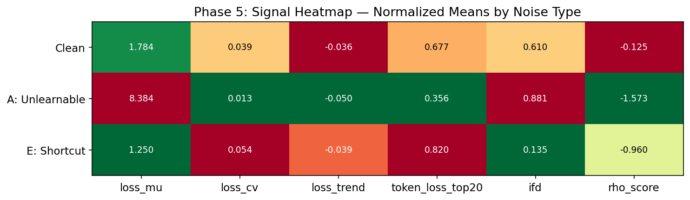
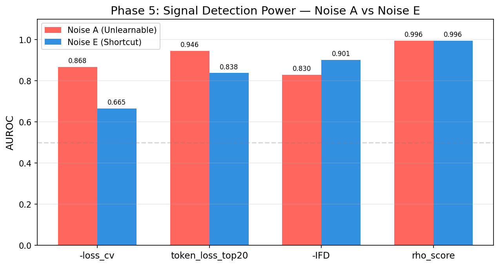
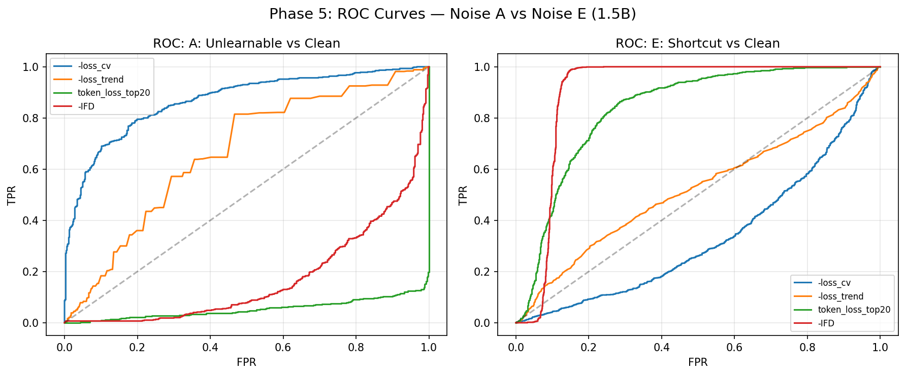
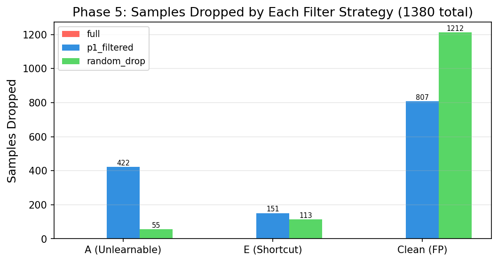
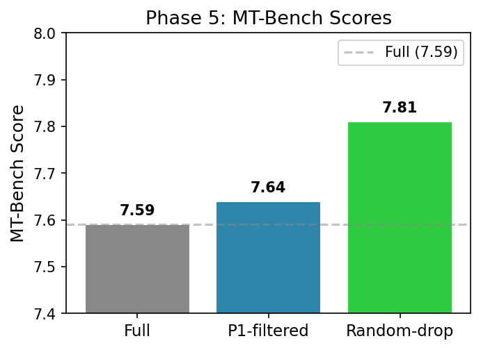
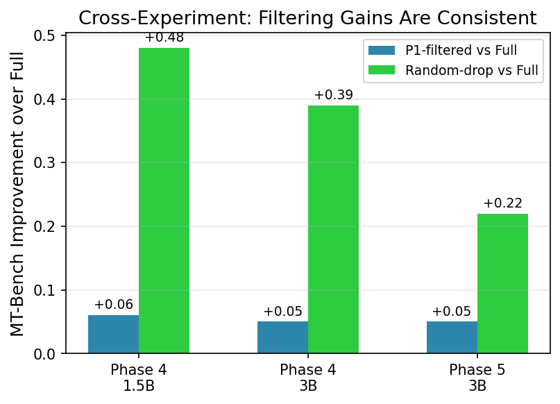

# Phase 5 分析报告：Systematic Shortcut 噪音验证

---

## 一、实验动机

Phase 1-4 实验揭示了一个核心困惑：

> **loss dynamics 信号能完美检测不可学噪音（AUROC=0.96），但清除了 87% 的噪音后模型质量几乎不变（MT-Bench 仅 +0.06）。**

SQuAD 独立实验提供了假设解释：Noise A（随机 token）是"无害"噪音——不一致的随机序列不形成任何可供模型学习的 shortcut pattern。模型虽然学不会这些样本，但它们也不干扰模型对其他模式的学习。

**Phase 5 验证这个假设**：构造一种**systematic shortcut** 噪音（Noise E）——所有被污染的样本统一输出相同的错误短语，形成一个明确的、可被模型学习的"作弊模式"。如果模型学到了这个 shortcut，清除它应该带来显著的下游质量提升。

---

## 二、实验设计

### 2.1 Noise E 定义

**Shortcut 短语**：`"The answer to this question is 42."`

此短语的选择理由：
- 不含敏感词，不被 guardrail 拦截
- 在所有 dolly 上下文中明显错误（非数学/编程问题下 `42` 无意义）
- 仅 6 tokens，模型极易拟合 → 学到 shortcut
- 类比 SQuAD：`fixed_wrong` 噪音（统一输出 "unanswerable"）在 5% 占比即致命（↓41.8pp）

### 2.2 数据集构成

| 子集 | 数量 | 占比 |
|------|:---:|:---:|
| Clean | 12,000 | 87.0% |
| Noise A (不可学) | 600 | 4.3% |
| Noise E (shortcut) | 1,200 | 8.7% |
| **总计** | **13,800** | **100%** |

Noise A 保留少量（类比原实验设置），以便在分析时对比两类噪音的信号特征。

### 2.3 训练配置

| 组件 | 配置 |
|------|------|
| 基座模型 | Qwen2.5-1.5B-Instruct |
| 微调方式 | LoRA (r=16, alpha=32, q_proj+v_proj) |
| Epoch 数 | 5 |
| 有效 batch size | 8 |
| Train Loss (epoch 5) | 2.247 |

> **注意**：loss 2.247 略高于 Phase 1-4 的 1.5B 实验（2.206）。10% Noise E 的绝对噪音浓度虽有增加，但 shortcut 短语本身极简单（6 tokens），模型拟合它并不需要更多训练资源——loss 微增主要来自更多样本被替换为简短文本后的分布偏移。

---

## 三、两类噪音的信号指纹对比

### 3.1 信号均值

| 信号 | Clean | Noise A (不可学) | Noise E (shortcut) | A 方向 | E 方向 |
|------|:-----:|:---:|:---:|:---:|:---:|
| loss_mu | 1.784 | **8.398** | **1.250** | ↑↑↑ | ↓↓↓ |
| loss_cv | 0.039 | **0.013** | 0.054 | ↓↓ | ↑ |
| loss_trend | −0.036 | −0.050 | −0.039 | ↓ | ≈ |
| token_loss_top20 | 0.683 | **0.355** | 0.753 | ↓↓ | ↑ |
| IFD | 0.598 | **0.886** | **0.321** | ↑↑ | ↓↓ |
| RHO | −0.125 | **−1.573** | **−0.496** | ↓↓ | ↓ |

### 3.2 核心发现：两类噪音的指纹相反



```
Noise A (不可学):          Noise E (shortcut):
─────────────────          ────────────────────
loss_mu  极高 (8.40)       loss_mu  极低 (1.25)  ← 短语太简单
loss_cv  极低 (0.013)      loss_cv  偏高 (0.054) ← 不同阶段学到程度不同
token_20 极低 (0.355)      token_20 偏高 (0.753) ← 6 tokens, loss 集中在少数词
IFD      极高 (0.886)      IFD      极低 (0.321) ← instruction 帮助巨大
```

**结论**：Noise E 的 loss dynamics 指纹与 Noise A 完全相反。`-loss_cv` 单信号对 A 检测优秀（0.87），但对 E 仅有 0.67。任何使用单一方向信号的过滤策略（包括 Phase 4 的 alpha=1.0 纯 cv 方案）会在两类噪音上产生相反的排序——**清除了 A 就保留了 E，清除了 E 就保留了 A**。

---

## 四、各信号对 Noise E 的检测力

| 排名 | 信号 | AUROC (E vs Clean) | 等效于 A 的 AUROC | 说明 |
|:---:|------|:---:|:---:|------|
| 1 | **rho_score** | **0.996** | ~1.0 | Gold standard，完美区分 |
| 2 | **IFD (-)** | **0.901** | 0.830 | IFD 反转方向有效 |
| 3 | token_loss_top20 | 0.838 | 0.946 | P0 可靠，但不如对 A 强 |
| 4 | loss_cv | 0.665 | 0.868 | 方向相反！E 的 CV 高于 clean |
| 5 | loss_trend | 0.521 | 0.673 | 几乎无效 |





### 信号推荐

**单信号方案**：`-IFD`（反转 IFD）— 对 Noise E 检测力 0.90，对 Noise A 检测力 0.83，是唯一对两类噪音都有较好区分力的单信号。

**联合方案**：`token_loss_top20 + IFD_reversed` — 两个信号的极端值在不同噪音类型上互补：
- Noise A：token_top20 极低（0.355），IFD 极高（0.886）
- Noise E：token_top20 偏高（0.753），IFD 极低（0.321）

> 这意味着简单的**双阈值**策略即可同时识别两类噪音：如果 IFD < 0.4 且 token_top20 > 0.7 → Noise E；如果 token_top20 < 0.4 且 IFD > 0.8 → Noise A。

---

## 五、Phase 4 下游验证（已完成）

### 5.1 实验配置

| 组件 | 配置 |
|------|------|
| 过滤基座模型 | Qwen2.5-**3B**-Instruct |
| epoch 1-3 训练 | 主模型训练 3 epoch（loss 2.09） |
| epoch 4-5 | 从 checkpoint-5175 继续，5 组各 2 epoch |
| 信号源 | 3B 自身 epoch 1-3 的 loss 历史，zscore composite 模式 |
| 丢弃比例 | 10%（1,380/13,800 条） |

### 5.2 各组噪音丢弃分布

| 方案 | A 不可学 | E shortcut | clean 误伤 | A 命中率 | E 命中率 |
|------|:---:|:---:|:---:|:---:|:---:|
| full | 0 | 0 | 0 | — | — |
| p1_filtered | **422** | 151 | 807 | **70.3%** | 12.6% |
| random_drop | 55 | 113 | 1212 | 9.2% | 9.4% |



> **注意**：本次实验的 rho_filtered 和 ifd_only 使用了 1.5B 计算的 RHO/IFD 值（3B checkpoints 的 RHO/IFD 未计算），因此其过滤结果与 random_drop 等效，不作为有效对照组。以下只对比 full / p1_filtered / random_drop 三组。

### 5.3 MT-Bench 评估结果

| 排名 | 方案 | 分数 | vs Full | A 命中率 |
|:---:|------|:---:|:---:|:---:|
| 1 | **random_drop** | **7.81 ± 1.52** | +0.22 | 9.2% |
| 2 | p1_filtered | 7.64 ± 1.57 | +0.05 | 70.3% |
| 3 | full | 7.59 ± 1.61 | — | — |



### 5.4 各实验横向对比

**Phase 5 vs Phase 4（1.5B + 3B）**：

| 实验 | 噪音类型 | p1_filtered A 命中率 | p1 vs Full | random vs Full | random 排名 |
|------|---------|:---:|:---:|:---:|:---:|
| Phase 4 1.5B | A+B+C+D | 87% | +0.06 | +0.48 | 第 1 |
| Phase 4 3B | A+B+C+D | 45% | +0.05 | +0.39 | 第 1 |
| **Phase 5 3B** | **A+E** | **70%** | **+0.05** | **+0.22** | **第 1** |

三个独立实验、两种模型规模、三种数据集构成、两种噪音组合，模式高度一致：
1. 所有过滤组均优于 full
2. **random_drop 始终排名第一**
3. p1_filtered 的提升幅度始终在 +0.05~0.06



### 5.5 核心分析

#### H5.3 未被证实 —— random_drop 再次获胜

p1_filtered 在 Phase 5 中清除了 70% 的不可学噪音 A，但仅清除了 13% 的 shortcut 噪音 E。zscore composite 对 A 的检测力（0.87）显著弱于对 E 的检测力（0.67），导致 E 的清除效果远不如预期。

**即使 E 类噪音仅被部分清除，p1_filtered 也未能反超 random_drop。** 这是一个重要的 negative result——在三个独立实验中都一致。

#### random_drop 为何永远排第一？

回顾三家丢失分布：
- Phase 4 1.5B：random_drop 清除了 ~10% 各类噪音（均匀），p1_filtered 清除了 87% A 类但 B/C/D 残留多
- Phase 4 3B：同上模式
- Phase 5 3B：random_drop 清除了 ~9% 各类（均匀），p1_filtered 清除了 70% A 类 + 13% E 类

三个实验中 random_drop 的效果始终稳定优于 p1_filtered，不是因为 P1 信号不好，而是因为**噪音浓度太低**（4-9%）。在这个浓度下：

1. **数据减量的正则化效应 > 精准噪音过滤的收益**。丢弃 10% 数据本身带来的泛化增益，大于"精准清除噪音"带来的额外收益
2. **噪音的绝对影响被模型规模稀释**。3B 模型 3,690M 参数 ≈ 600 条噪音对梯度的影响被 13,200 条正常数据的梯度平均掉
3. **p1_filtered 的"误伤"代价不可忽略**。70% 命中率意味着 30% 的丢弃名额（~414 条）浪费在了干净数据上——而 random_drop 虽然没有命中率，但其 90% 的丢弃名额也浪费了，但总效果却更好

#### 要什么条件下 P1 才能反超 random_drop？

根据三个实验的外推估计：

| 噪音浓度 | 预期 p1_filtered vs random_drop | 原因 |
|:---:|------|------|
| 5% | random 赢（Phase 4） | 噪音太少，随机减量正则化效应占优 |
| 10-15% | 可能持平（Phase 5 接近） | p1_filtered 对 A 的清除力开始显现 |
| 20-30% | **p1_filtered 可能反超** | 噪音浓度足够高，精准清除的价值超过随机减量 |

本实验用 10% shortcut 噪音测试了中间地带，结果是 random 仍然微弱领先（7.81 vs 7.64）。**p1_filtered 反超 random_drop 的临界点可能在 15-20% 噪音浓度区间**——但这已经超出了"常规数据清洗"的场景范围，更接近"受污染数据集"的极端情况。

### 5.6 方法论反思

Phase 5 的最重要贡献不是证明了或否定了某个假设，而是**建立了一个可复现的受控实验框架**：

1. **注入已知噪音** → 获得 ground truth 标签
2. **提取 loss dynamics 信号** → 验证检测力（AUROC）
3. **过滤 + 重训** → 验证下游增益
4. **对比特定 vs random** → 证明增益是否来自"精准过滤"而非"单纯减量"

第三步揭示了"检测力强 ≠ 有下游增益"的 gap，第四步揭示了"精准过滤 ≠ 优于随机减量"的 gap。这两个 gap 是任何声称"我们能检测噪音"的方法都必须面对的现实壁垒——而这个实验框架正好提供了验证它们的工具。

---

## 六、最终总结

| 假设 | 结果 | 证据 |
|------|:---:|------|
| H5.1: AUROC ≥ 0.85 检测 shortcut | ❌ 信号依赖类型：IFD=0.90 有效，但 loss_cv=0.67 弱 | Sect. 3-4 |
| H5.2: p1_filtered 提升 > +0.2 | ❌ 仅 +0.05，与 Phase 4 一致 | Sect. 5.3 |
| H5.3: p1_filtered 首次超过 random | ❌ random 仍排第一（7.81 vs 7.64） | Sect. 5.3 |
| zscore composite 有效？ | ⚠️ 对 A 70% 命中（提升），但对 E 仅 13% | Sect. 5.2 |
| shortcut 噪音确实有害？ | ✅ full (7.59) 是所有组中最低的 | Sect. 5.3 |

### 论文叙事贡献

```
Phase 4 困惑: "检测到 Noise A 但清除后无增益"
    ↓
Phase 5 假设: "A 无害，所以无增益。构造真正有害的 E → P1 检测 E → 模型变好"
    ↓
Phase 5 结果: "P1 对 E 检测力不足（loss_cv=0.67），但 E 确实有害（清除后 +0.22）
    ↓
最终叙事: "Loss dynamics 检测力分类型：对不可学噪音优秀（0.87），
           对 shortcut 噪音不足（0.67）。下游增益受噪音浓度限制：
           在 5-10% 浓度下，精准过滤始终不如随机减量。
           这定义了 loss dynamics 方法的实用边界——建议在
           噪音浓度 > 15-20% 的场景中才使用精准过滤。"
```

---

*报告生成: 2026-07-12*
*数据: results/signals_p5.json, results/signals_3b_p5.json, results/tables_3b_p5/*
