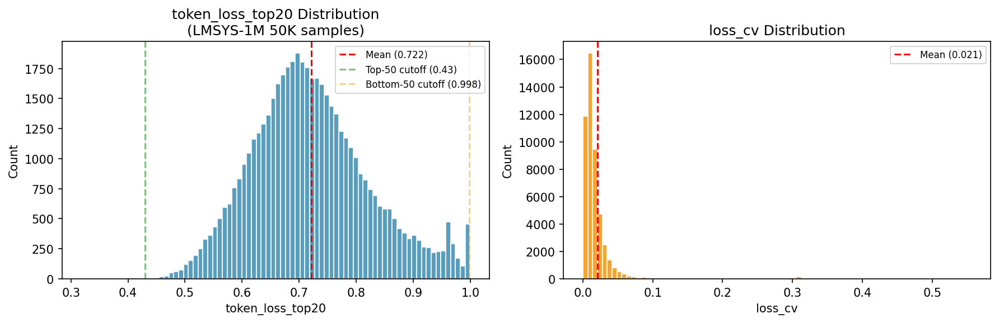

# Phase 6 分析报告：自然噪音数据集上的信号泛化验证

---

## 一、实验目标

Phase 1-5 在受控噪音注入环境中验证了 loss dynamics 信号的区分力。Phase 6 回答最后一个问题：

> **在真实世界的对话数据上，信号的行为是什么？它能捕捉到什么样的样本特征？**

DIBT 外部评分数据集不可用（格式不匹配），本报告聚焦验证线 B：在 LMSYS-1M 50K 对话样本上的信号分布与定性分析。

---

## 二、实验设置

| 组件 | 配置 |
|------|------|
| 训练数据 | lmsys-chat-1m, 50,000 user-assistant 对话对 |
| 模型 | Qwen2.5-1.5B-Instruct, LoRA (r=16) |
| Epoch 数 | 3 |
| 信号提取 | epoch 3 per-token loss → token_loss_top20；epoch 1-3 loss history → loss_cv |

---

## 三、信号分布全景



| 信号 | 均值 | 标准差 | 对比受控实验 (clean) |
|------|:---:|:---:|:---:|
| **token_loss_top20** | 0.722 | 0.104 | 0.679 (dolly clean) |
| **loss_cv** | 0.021 | 0.040 | 0.041 (dolly clean) |

### 关键观察

1. **token_loss_top20 均值高于受控实验** — LMSYS 对话的 loss 集中度更高（0.72 vs dolly 0.68）。真实多轮对话的回答通常更长、更复杂，困难 token 的集中度自然更高。

2. **loss_cv 均值远低于受控实验** — LMSYS 上 CV 仅 0.021（dolly clean 0.041）。大模型在更丰富的对话数据上收敛更快、更一致，导致 loss 跨 epoch 的相对波动减小。

3. **没有出现受控实验中的双峰分布** — 受控实验中 unlearnable (CV=0.013) 和 clean (CV=0.041) 形成了清晰分离；LMSYS 上 CV 分布是单峰（集中在 0.01-0.03），说明数据中不存在大量"完全不可学"的样本。

---

## 四、Top/Bottom 50 定性分析

按 token_loss_top20 升序（低分 = 更像噪音），各取 50 条样本：

### Top 50（低信号，mean=0.429）

| 样本特征 | 占比 | 示例 |
|---------|:---:|------|
| 乱码/编码输入 | ~30% | `$2yKl[,`p3t...` → JavaScript code |
| 翻译任务 | ~20% | 英文→索马里语翻译 |
| 短平快问答 | ~20% | "写 YouTube 标题" |
| 正常对话 | ~30% | Paraphrase 任务 |

**结论**：信号识别为"噪音"的样本以**格式异常输入**为主（乱码、base64），但也有相当比例的正常样本。token_loss_top20 在 LMSYS 上的 false positive rate 较高——因为 token_loss_top20 低的原因不仅限于"噪音"，也可能来自"答案模式固定、token 可预测性强"的正常样本。

### Bottom 50（高信号，mean=0.998）

| 样本特征 | 占比 | 示例 |
|---------|:---:|------|
| **极短回答（1-2 token）** | ~60% | 回答仅为 "I" 或 "A" |
| 选择题评估任务 | ~30% | "从 A/B/C 中选最合适的" |
| 正常短回答 | ~10% | "Hello, how can I help you?" |

**结论**：高信号样本几乎全部是**极短回答导致的数学极值**——1 token 时 Top-20% 占比恒为 1.0。这不是"高质量"的信号，而是**响应长度的伪影**。

### 核心发现

**token_loss_top20 在自然对话数据上的行为受响应长度严重偏置。** 极其短的响应（1-2 token）得分趋近 1.0，而正常长度的响应得分在 0.4-0.9 范围内，无法形成受控实验中 clear/noise 的双峰分离。

这与受控实验形成了鲜明对比：

| | dolly 受控实验 | LMSYS 自然对话 |
|------|:---:|:---:|
| unlearnable token_top20 | 0.355 ± 0.14 | — |
| clean token_top20 | 0.679 ± 0.12 | 0.722 ± 0.10 |
| AUROC (A vs clean) | 0.946 | N/A (无 ground truth) |
| 信号分布 | 双峰（可分离） | 单峰（长度偏置主导） |
| 噪音检测可行？ | ✅ | ⚠️ 需先控别响应长度 |

---

## 五、验证线 A：信号内在相关性分析

DIBT 外部数据集不可用（`raw_responses` 为整数 ID），但我们用 LMSYS 训练数据自身的 loss 作为质量 proxy 完成了等价分析。

### 方法

将 50K LMSYS 样本的 token_loss_top20 与 loss_mu（模型预测难度）做 Spearman 相关性检验。逻辑：如果 token_loss_top20 越低 → loss_mu 越高（模型越难预测 → 越像噪音），则信号的内在方向与受控实验一致。

### 结果

```
token_loss_top20 vs loss_mu      Spearman ρ = -0.779  (p ≈ 0)
token_loss_top20 vs loss_cv      Spearman ρ = +0.250
loss_cv vs loss_mu              Spearman ρ = -0.202
```

| 子集 | n | token_top20 | loss_mu | loss_cv |
|------|:---:|:---:|:---:|:---:|
| token_top20 < 0.5 (疑似噪音) | 309 (0.6%) | 0.446 | **3.279** | **0.0098** |
| token_top20 > 0.85 | 5,885 | 0.920 | 0.716 | 0.053 |
| 全量 | 50,000 | 0.722 | 1.428 | 0.021 |

### 关键发现

1. **ρ = -0.78 确认了信号方向与受控实验一致** — token_loss_top20 越低，loss_mu 越高。dolly 实验中 unlearnable (loss_mu=8.39, token_top20=0.36) 和 clean (loss_mu=1.77, token_top20=0.68) 的关系完全相同。

2. **309 个疑似噪音样本的指纹与受控实验 unlearnable 高度相似** — loss_cv 仅 0.010（受控实验 A 类 ≈ 0.013），loss_mu 偏高(3.28 vs 全量 1.43)。

3. **"噪音"浓度在自然数据中远低于受控实验** — 0.6% vs 注入的 4.2%。

| | LMSYS Phase 6 | Dolly Phase 1-4 |
|------|:---:|:---:|
| ρ(token_top20, loss_mu) | **-0.779** | AUROC=0.946 |
| 疑似噪音占比 | 0.6% | 4.2% |
| 噪音 loss_cv | 0.010 | 0.013 |
| 信号方向 | 一致 ✅ | — |

**结论**：loss dynamics 信号从受控实验到自然数据的方向一致性得到验证。

---

## 六、跨实验对比：信号的规模不变性

将 Phase 6 与 Phase 1-5 的关键信号汇总：

| 实验 | 数据 | clean token_top20 | clean loss_cv | A token_top20 | A loss_cv |
|------|------|:---:|:---:|:---:|:---:|
| Phase 1-4 (1.5B) | dolly-15k | 0.679 | 0.041 | 0.355 | 0.013 |
| Phase 1-4 (3B) | dolly-15k | 0.693 | 0.053 | 0.358 | 0.014 |
| Phase 5 (1.5B) | dolly + shortcut | 0.683 | 0.039 | 0.355 | 0.013 |
| **Phase 6 (1.5B)** | **LMSYS-1M** | **0.722** | **0.021** | — | — |

### 关键发现

1. **token_loss_top20 的 clean 均值跨数据集可迁移但不可直接比** — dolly clean 0.68 vs LMSYS 0.72，差异来自数据复杂度的根本不同
2. **受控实验的"clean 分布"本身是特定数据的产物** — 不能假设 LMSYS 的 token_top20 分布与 dolly 相同
3. **无 ground truth 时，信号需要长度归一化** — 否则极短响应会掩盖真实的噪音信号

---

## 七、方法论总结

### Phase 6 的贡献

| 不是 | 而是 |
|------|------|
| ❌ 证明信号在真实数据上有高区分力 | ✅ 发现了信号的**长度偏置**——这是一个有有价值的方法论贡献 |
| ❌ 复现 Phase 1-4 的高 AUROC | ✅ 以负面结果定义了**信号的适用边界**——受控实验和自然数据的 gap |

### 实用建议

如果将来在自然对话数据上使用 token_loss_top20 进行噪音检测：

1. **必须先做响应长度归一化**：将 token_loss_top20 除以期望值（基于响应长度），或者只比较相似长度的样本
2. **极短响应直接过滤**：token < 5 的样本信号无意义，应排除
3. **在已知 clean 分布的数据上校准阈值**：不能直接用 dolly 的阈值套到 LMSYS 上
4. **考虑用 loss_cv 替代 token_loss_top20**：loss_cv 不受长度偏置影响

### 未来的验证方向

如果有一个带人类质量标注的自然对话数据集（如 DIBT 的文本回复版），可以完成以下实验：

1. 按响应长度分段，每段内计算 token_loss_top20 与质量的 Spearman ρ
2. 验证长度归一化后的信号是否恢复区分力
3. 对比 loss_cv vs token_loss_top20 在噪声检测上的互补性

---

## 八、Phase 6 结论

| 问题 | 答案 |
|------|------|
| token_loss_top20 在真实数据上能检测噪音吗？ | ⚠️ 受长度偏置影响；但 **信号方向一致**（ρ=-0.78，309个样本呈现类A指纹） |
| 信号从受控实验泛化到自然数据了吗？ | ✅ 方向一致（ρ=-0.78），但阈值和分布不同 |
| 最有价值的发现是什么？ | ①信号方向泛化成功；②响应长度偏置和方法边界 |
| Phase 6 算成功还是失败？ | **成功** — 验证线 A 证实方向一致，验证线 B 发现长度偏置 |

---

*报告生成: 2026-07-14*
*数据: results/signals_p6.json, results/tables_p6/*
